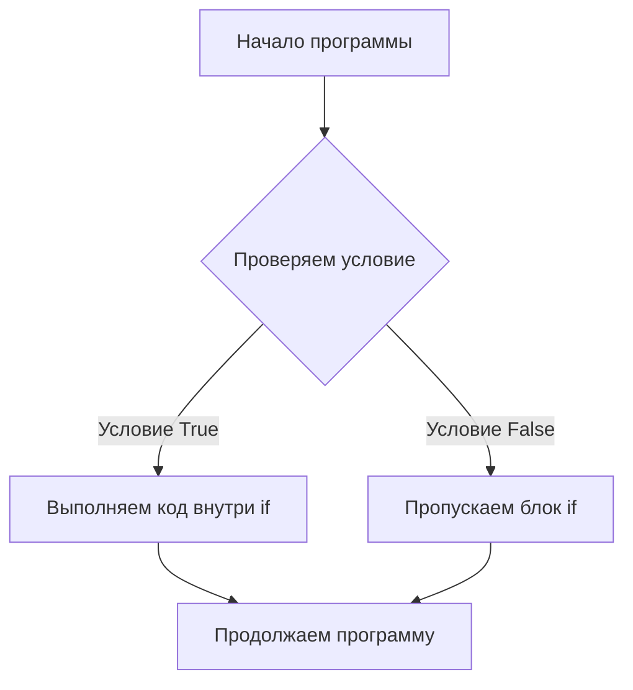
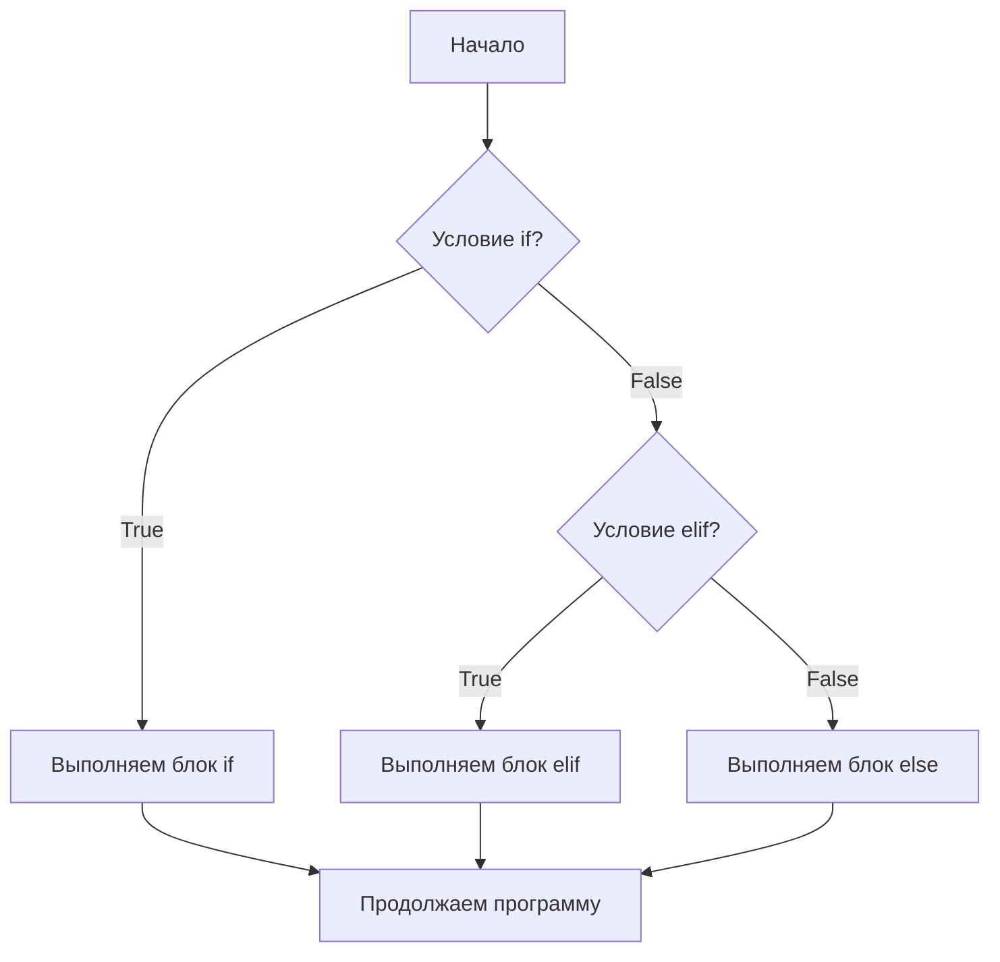
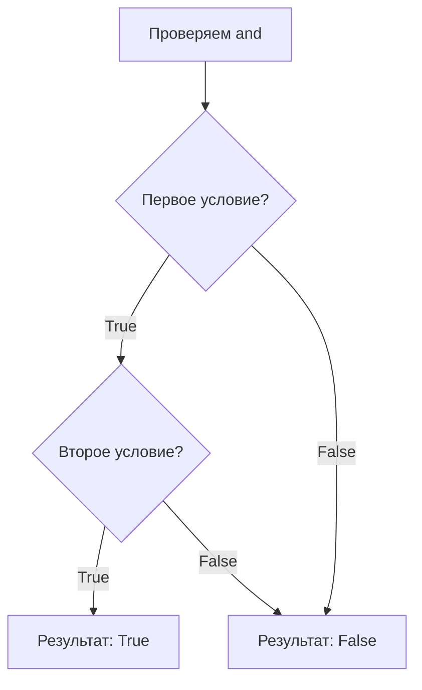
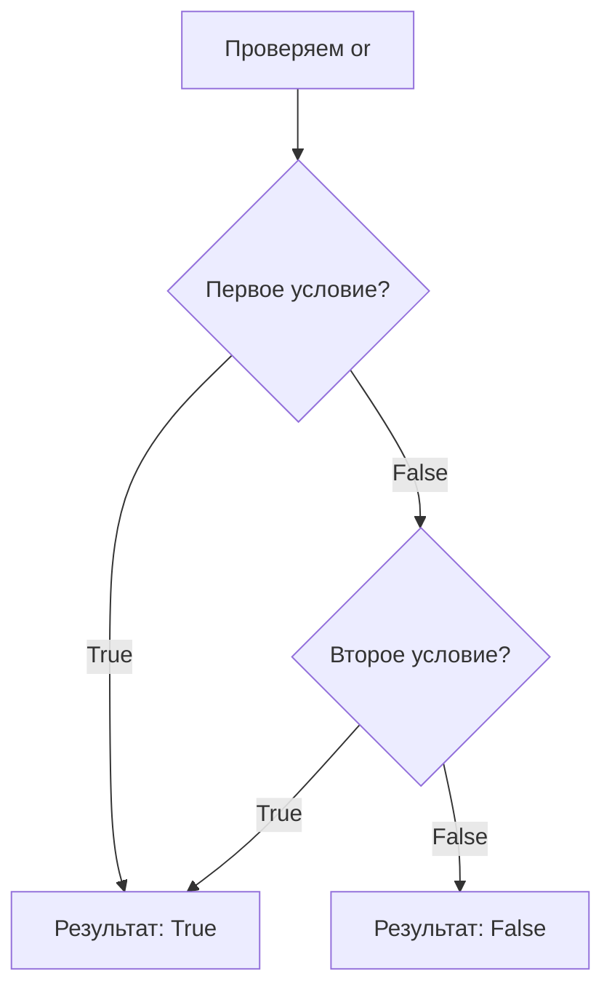
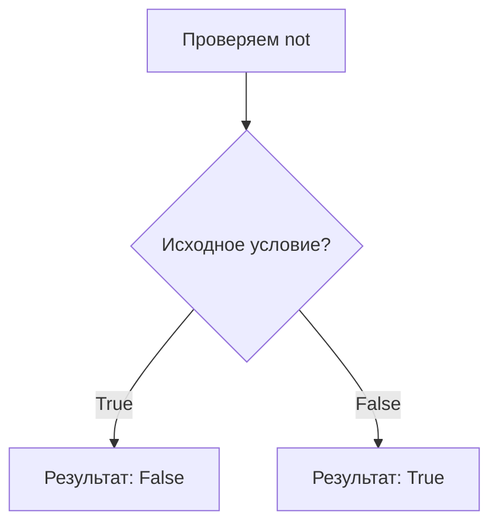
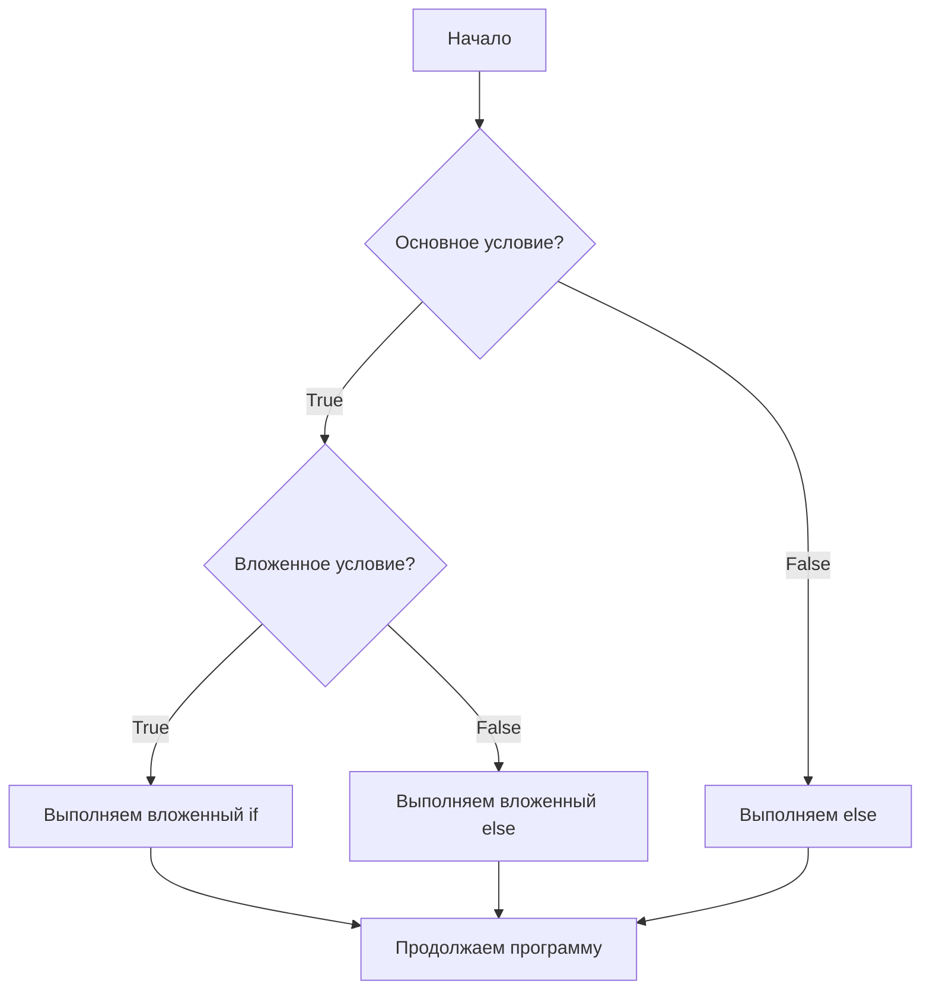

# Логические выражения и условия в Python

**Оглавление:**
1. [Логические выражения и True False bool](#логические-выражения)
2. [Условия и логическое ветвление if](#условия-if)
3. [Логическое ветвление elif else](#elif-else)
4. [and, or, not](#and-or-not)
5. [Дополнительный разбор темы](#дополнительный-разбор)

---

### 🧐 Краткая выжимка

*   **Логические выражения** — вопросы, на которые Python отвечает `True` (правда) или `False` (ложь)
*   **if** — выполняет код, если условие истинно: `if условие:`
*   **elif** — выполняет код, если условие истинно: `elif условие:`, а предыдущие ложны
*   **else** — выполняет код, если все условия ложны
*   **and** — "И" (оба условия истинны)
*   **or** — "ИЛИ" (хотя бы одно условие истинно)
*   **not** — "НЕ" (меняет значение на противоположное)

---

<a id="логические-выражения"></a>
### 1. Логические выражения и True False bool

Представь, что ты задаешь компьютеру вопросы, на которые можно ответить только "ДА" или "НЕТ". В Python эти ответы называются `True` (правда) и `False` (ложь). Это **логический тип данных** — `bool`.

```python
# Простые логические выражения
print(5 > 3)    # True (5 больше 3?)
print(2 == 1)   # False (2 равно 1?)
print(10 != 5)  # True (10 не равно 5?)

# Сравнения с переменными
age = 12
print(age >= 10)  # True (возраст больше или равен 10?)
print(age < 8)    # False (возраст меньше 8?)
```

**Операторы сравнения:**
- `>` больше
- `<` меньше  
- `>=` больше или равно
- `<=` меньше или равно
- `==` равно
- `!=` не равно

<a id="условия-if"></a>
### 2. Условия и логическое ветвление if

**if** — это как сказать компьютеру: "ЕСЛИ это правда, ТОГДА сделай вот это". Это позволяет программе принимать решения.



```python
# Простое условие
temperature = 25

if temperature > 20:
    print("Надень футболку, тепло!")
```

**Важно:** Код внутри условия пишется с отступом (4 пробела или Tab)!

```python
# Пример с вводом данных
age = int(input("Сколько тебе лет? "))

if age >= 10:
    print("Ты можешь играть в эту игру!")
    print("Удачи!")
```

<a id="elif-else"></a>
### 3. Логическое ветвление elif else

Когда нужно проверить несколько условий подряд, используем `elif` (сокращение от "else if") и `else`.



```python
# Полная структура условий
score = 85

if score >= 90:
    print("Отлично! Ты молодец!")
elif score >= 70:
    print("Хорошо! Могло быть лучше.")
elif score >= 50:
    print("Удовлетворительно. Поработай еще.")
else:
    print("Нужно подучить материал.")
```

Как это работает:
- Проверяет условия по порядку
- Выполняет код первого истинного условия
- Если ни одно не подошло — выполняет `else`

```python
# Игровой пример
health = 30

if health <= 0:
    print("Игра окончена!")
elif health <= 20:
    print("Осторожно! Мало здоровья!")
else:
    print("Здоровье в норме.")
```

<a id="and-or-not"></a>
### 4. and, or, not

Эти операторы помогают создавать сложные условия.

**and** — "И" (оба условия должны быть истинны)


```python
age = 12
has_permission = True

if age >= 10 and has_permission:
    print("Можешь играть в игру!")
# Выполнится только если тебе 10+ И есть разрешение
```

**or** — "ИЛИ" (хотя бы одно условие истинно)


```python
day = "суббота"
is_holiday = True

if day == "суббота" or day == "воскресеньe" or is_holiday:
    print("Ура! Можно отдохнуть!")
# Выполнится в выходные ИЛИ в праздник
```

**not** — "НЕ" (меняет значение на противоположное)


```python
is_raining = False

if not is_raining:
    print("Можно гулять!")
# Выполнится, если НЕ идет дождь
```

<a id="дополнительный-разбор"></a>
### 5. Дополнительный разбор темы

**Вложенные условия** — условия внутри других условий:



```python
age = 12
has_ticket = True

if age >= 10:
    if has_ticket:
        print("Проходи в кинотеатр!")
    else:
        print("Нужно купить билет.")
else:
    print("Тебе еще рано в кино.")
```

**Практический пример — мини-игра:**

```python
print("Добро пожаловать в квест!")
print("Ты стоишь перед двумя дверями...")

choice = input("Какую дверь выберешь? (1 или 2): ")

if choice == "1":
    print("Ты вошел в комнату с сокровищами!")
    has_key = input("Видишь золотой ключ? (да/нет): ")
    
    if has_key == "да":
        print("Поздравляю! Ты нашел клад!")
    else:
        print("К сожалению, клад спрятан...")

elif choice == "2":
    print("Ой! Это комната с ловушкой!")
    print("Игра окончена.")

else:
    print("Нужно выбрать 1 или 2!")
```

**Частые ошибки:**
- Забыть двоеточие после условия
- Не сделать отступ для кода внутри условия
- Путать `=` (присвоение) и `==` (сравнение)

```python
# НЕПРАВИЛЬНО:
if age = 12:    # Ошибка! Нужно ==
    print("Тебе 12 лет")

# ПРАВИЛЬНО:
if age == 12:
    print("Тебе 12 лет")
```
