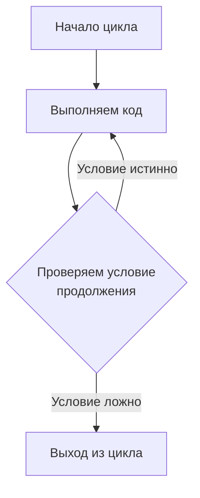
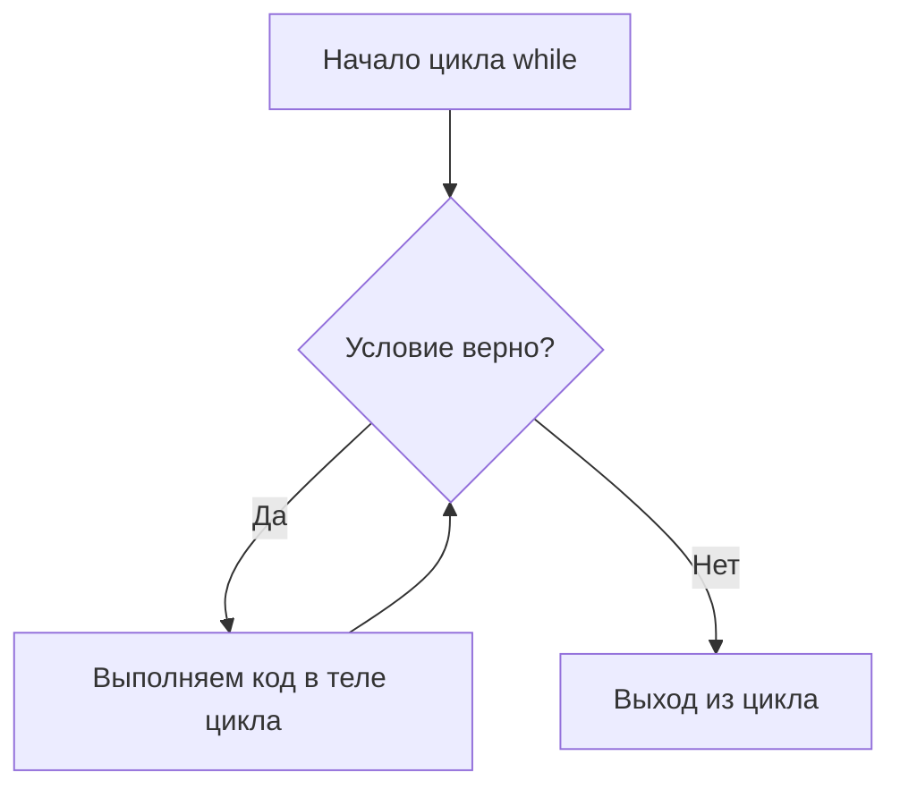
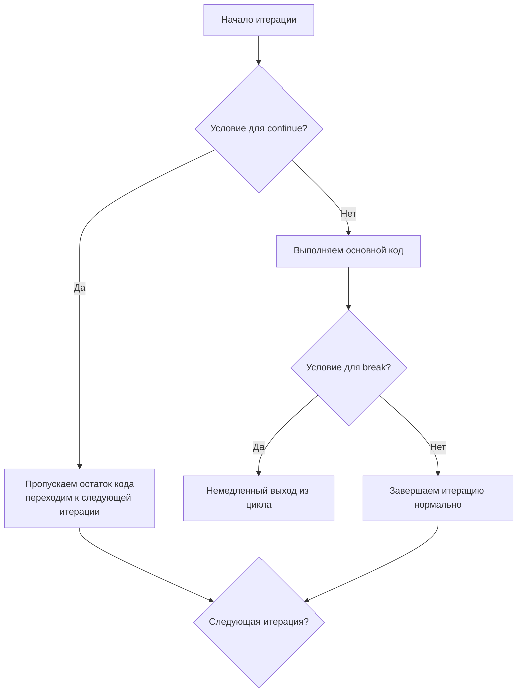
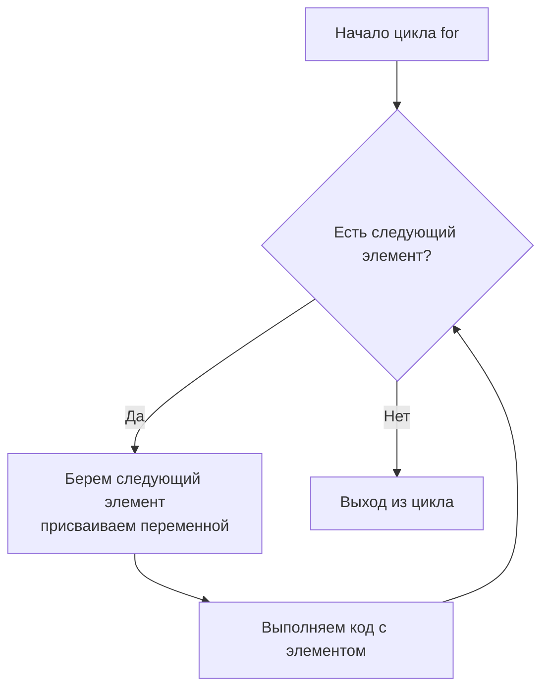

# Циклы в Python: Повторяем действия много раз

**Оглавление:**
1. [Что такое циклы?](#что-такое-циклы)
2. [Цикл while](#цикл-while)
3. [continue и break](#continue-break)
4. [Цикл for](#цикл-for)
5. [Дополнительные примеры](#дополнительные-примеры)

---

### 🧐 Краткая выжимка

*   **Цикл** — способ повторять код несколько раз
*   **while** — повторяет код, пока условие истинно
*   **for** — повторяет код для каждого элемента в последовательности
*   **break** — досрочно выходит из цикла
*   **continue** — переходит к следующей итерации цикла
*   **range()** — создает последовательность чисел
*   Циклы могут перебирать строки, списки и другие коллекции

---

<a id="что-такое-циклы"></a>
### 1. Что такое циклы?

Представь, что тебе нужно написать 100 раз "Я буду учить Python". Вместо того чтобы копировать эту строку 100 раз, можно использовать **цикл** — специальную конструкцию, которая повторяет код несколько раз.



**Зачем нужны циклы:**
- Автоматизируют повторяющиеся задачи
- Обрабатывают много данных за раз
- Создают игры и интерактивные программы
- Экономят время и уменьшают ошибки

<a id="цикл-while"></a>
### 2. Цикл while

Цикл **while** повторяет код, пока условие остается истинным (`True`).



**Базовый синтаксис:**
```python
while условие:
    # код, который повторяется
    # пока условие истинно
```

**Пример 1: Счетчик**
```python
# Считаем от 1 до 5
counter = 1
while counter <= 5:
    print(f"Счет: {counter}")
    counter = counter + 1  # Увеличиваем счетчик на 1

print("Цикл завершен!")
```

**Вывод:**
```
Счет: 1
Счет: 2
Счет: 3
Счет: 4
Счет: 5
Цикл завершен!
```

**Пример 2: Игра с угадыванием числа**
```python
secret_number = 7
guess = 0

print("Угадай число от 1 до 10!")

while guess != secret_number:
    guess = int(input("Твой вариант: "))
    
    if guess < secret_number:
        print("Слишком маленькое!")
    elif guess > secret_number:
        print("Слишком большое!")

print("Поздравляю! Ты угадал!")
```

<a id="continue-break"></a>
### 3. continue и break

**break** — немедленно выходит из цикла
**continue** — переходит к следующей итерации, пропуская оставшийся код



**Пример с break:**
```python
# Ищем первое четное число
numbers = [1, 3, 5, 8, 9, 2, 7]

for num in numbers:
    if num % 2 == 0:  # Если число четное
        print(f"Нашли четное число: {num}")
        break  # Выходим из цикла
    print(f"Проверяем {num} - нечетное")

print("Поиск завершен!")
```

**Пример с continue:**
```python
# Печатаем только нечетные числа от 1 до 10
number = 0

while number < 10:
    number = number + 1
    
    if number % 2 == 0:  # Если число четное
        continue  # Пропускаем печать
    
    print(f"Нечетное число: {number}")

print("Готово!")
```

<a id="цикл-for"></a>
### 4. Цикл for

Цикл **for** используется для перебора элементов в последовательности (строка, список, range и т.д.).



**Синтаксис:**
```python
for переменная in последовательность:
    # код, выполняемый для каждого элемента
```

**Пример 1: Перебор строки**
```python
# Перебираем буквы в слове
word = "ПИТОН"

for letter in word:
    print(f"Буква: {letter}")

print("Слово разобрано!")
```

**Вывод:**
```
Буква: П
Буква: И
Буква: Т
Буква: О
Буква: Н
Слово разобрано!
```

**Пример 2: Функция range()**
```python
# range(старт, стоп, шаг)
# range(стоп) - от 0 до стоп-1

# Считаем от 0 до 4
for i in range(5):
    print(f"Число: {i}")

print("---")

# Считаем от 2 до 6
for i in range(2, 7):
    print(f"Число: {i}")

print("---")

# Четные числа от 2 до 10
for i in range(2, 11, 2):
    print(f"Четное число: {i}")
```

**Пример 3: Сумма чисел**
```python
# Считаем сумму чисел от 1 до 10
total = 0

for number in range(1, 11):
    total = total + number
    print(f"Добавили {number}, сумма: {total}")

print(f"Итоговая сумма: {total}")
```

<a id="дополнительные-примеры"></a>
### 5. Дополнительные примеры

**Таблица умножения:**
```python
number = 5

print(f"Таблица умножения для {number}:")
for i in range(1, 11):
    result = number * i
    print(f"{number} × {i} = {result}")
```

**Обратный отсчет:**
```python
import time  # Импортируем модуль для пауз

print("Обратный отсчет!")
for seconds in range(10, 0, -1):
    print(seconds)
    time.sleep(1)  # Пауза 1 секунда

print("ПУСК!")
```

**Подсчет гласных в слове:**
```python
word = "программирование"
vowels = "аеёиоуыэюя"
count = 0

for letter in word:
    if letter in vowels:
        count = count + 1
        print(f"Нашли гласную '{letter}'")

print(f"В слове '{word}' найдено {count} гласных букв")
```

**Бесконечный цикл с выходом:**
```python
print("Магазин сладостей!")
print("Введи 'стоп' чтобы выйти")

while True:  # Бесконечный цикл
    candy = input("Какую конфету хочешь? ")
    
    if candy.lower() == "стоп":
        break  # Выходим из цикла
    
    print(f"Держи {candy}!")
    print("---")

print("Магазин закрыт!")
```
