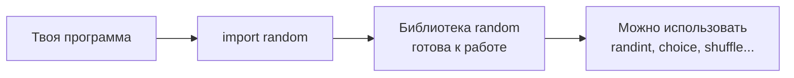
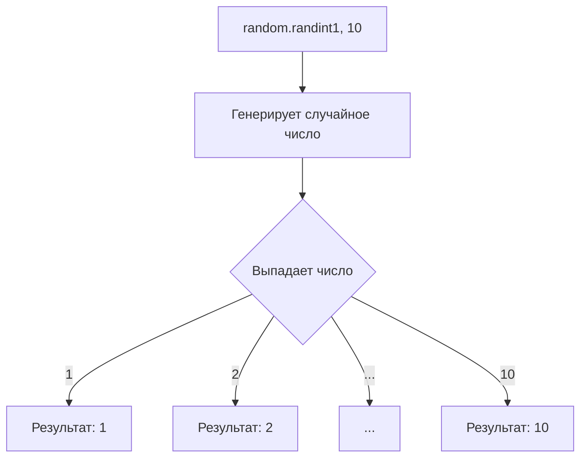
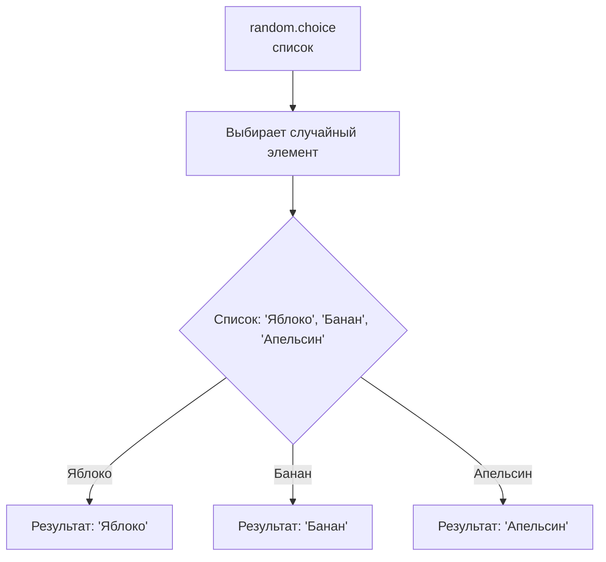
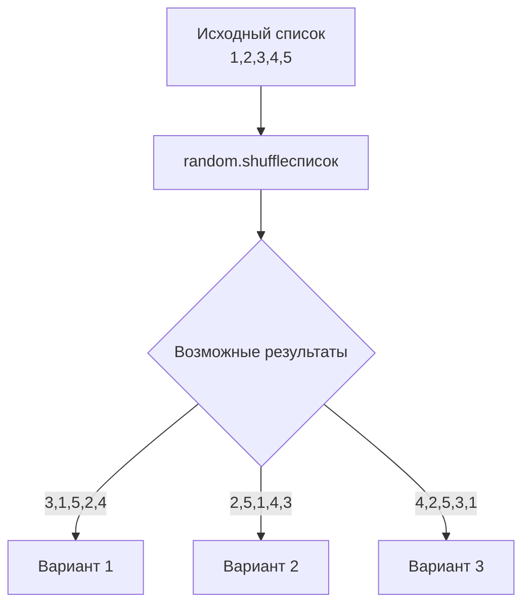

# Библиотека random: Случайность в Python

**Оглавление:**
1. [Импорт библиотек и библиотека random](#импорт-библиотек)
2. [random.randint() - случайные целые числа](#randint)
3. [Другие полезные функции](#другие-функции)
4. [random.choice() - случайный элемент](#choice)
5. [random.shuffle() - перемешивание элементов](#shuffle)
6. [Практические примеры](#практические-примеры)

---

### 🧐 Краткая выжимка

*   **import** — команда для подключения дополнительных возможностей
*   **random** — библиотека для работы со случайными числами
*   **randint(a, b)** — случайное целое число от a до b
*   **choice(список)** — случайный элемент из списка
*   **shuffle(список)** — перемешивает элементы списка
*   **random()** — случайное число от 0.0 до 1.0
*   **uniform(a, b)** — случайное дробное число от a до b

---

<a id="импорт-библиотек"></a>
### 1. Импорт библиотек и библиотека random

Представь, что Python — это базовый набор конструктора. А **библиотеки** — это дополнительные наборы деталей (колеса, моторы, окна), которые можно подключить, когда они нужны.

**Импорт** — это команда "принести коробку с дополнительными деталями".



**Как работает импорт:**
```python
# Подключаем всю библиотеку random
import random

# Теперь можем использовать её функции
число = random.randint(1, 10)
```

**Библиотека random** содержит функции для работы со случайными числами. Она нужна, когда нужно добавить в программу элемент неопределенности — как в играх, лотереях, случайных тестах.

<a id="randint"></a>
### 2. random.randint() - случайные целые числа

**random.randint(a, b)** возвращает случайное целое число N, где a ≤ N ≤ b.



**Примеры:**
```python
import random

# Бросок кубика (1-6)
dice = random.randint(1, 6)
print(f"На кубике выпало: {dice}")

# Случайный возраст от 10 до 12 лет
age = random.randint(10, 12)
print(f"Случайный возраст: {age}")

# Игра: угадай число от 1 до 100
secret_number = random.randint(1, 100)
print(f"Загадано число от 1 до 100. Попробуй угадать!")
```

**Игра "Угадай число":**
```python
import random

secret = random.randint(1, 50)
attempts = 0

print("Я загадал число от 1 до 50. Угадай!")

while True:
    guess = int(input("Твой вариант: "))
    attempts += 1
    
    if guess < secret:
        print("Слишком маленькое!")
    elif guess > secret:
        print("Слишком большое!")
    else:
        print(f"Поздравляю! Ты угадал за {attempts} попыток!")
        break
```

<a id="другие-функции"></a>
### 3. Другие полезные функции

**random.random()** — случайное дробное число от 0.0 до 1.0
```python
import random

chance = random.random()
print(f"Случайная вероятность: {chance:.2f}")

if chance < 0.3:
    print("Выпал редкий шанс! (30%)")
```

**random.uniform(a, b)** — случайное дробное число от a до b
```python
import random

# Случайная температура от 36.0 до 37.5
temperature = random.uniform(36.0, 37.5)
print(f"Температура: {temperature:.1f}°C")

# Случайная оценка от 3.5 до 5.0
grade = random.uniform(3.5, 5.0)
print(f"Оценка: {grade:.1f}")
```

<a id="choice"></a>
### 4. random.choice() - случайный элемент

**random.choice(список)** возвращает случайный элемент из списка, строки или другой последовательности.



**Примеры:**
```python
import random

# Случайный фрукт
fruits = ["яблоко", "банан", "апельсин", "виноград"]
random_fruit = random.choice(fruits)
print(f"Сегодня на перекус: {random_fruit}")

# Случайная буква из строки
word = "ПРОГРАММИРОВАНИЕ"
random_letter = random.choice(word)
print(f"Случайная буква: {random_letter}")

# Генератор случайных имён для игры
names = ["Алексей", "Мария", "Иван", "София", "Дмитрий"]
player_name = random.choice(names)
print(f"Твое игровое имя: {player_name}")
```

<a id="shuffle"></a>
### 5. random.shuffle() - перемешивание элементов

**random.shuffle(список)** перемешивает элементы списка в случайном порядке. Изменяет исходный список!



**Примеры:**
```python
import random

# Перемешиваем карты
cards = ["Туз", "Король", "Дама", "Валет", "10", "9"]
print(f"До перемешивания: {cards}")

random.shuffle(cards)
print(f"После перемешивания: {cards}")

# Викторина с перемешанными вариантами
questions = [
    {"вопрос": "Сколько планет в Солнечной системе?", "ответ": "8"},
    {"вопрос": "Столица России?", "ответ": "Москва"},
    {"вопрос": "2 + 2 × 2 = ?", "ответ": "6"}
]

random.shuffle(questions)
print("Вопросы в случайном порядке:")
for q in questions:
    print(f"- {q['вопрос']}")
```

<a id="практические-примеры"></a>
### 6. Практические примеры


**Игра "Камень-Ножницы-Бумага":**
```python
import random

choices = ["камень", "ножницы", "бумага"]
computer_choice = random.choice(choices)

print("Выбери: камень, ножницы или бумага")
player_choice = input("Твой выбор: ").lower()

print(f"Компьютер выбрал: {computer_choice}")

if player_choice == computer_choice:
    print("Ничья!")
elif (player_choice == "камень" and computer_choice == "ножницы") or \
     (player_choice == "ножницы" and computer_choice == "бумага") or \
     (player_choice == "бумага" and computer_choice == "камень"):
    print("Ты выиграл!")
else:
    print("Компьютер выиграл!")
```

**Генератор случайных тестов:**
```python
import random

# Список вопросов и ответов
questions = [
    ("Сколько будет 5 × 7?", "35"),
    ("Столица Франции?", "Париж"),
    ("Самая большая планета?", "Юпитер")
]

# Перемешиваем вопросы
random.shuffle(questions)

print("Случайный тест:")
score = 0

for question, correct_answer in questions:
    user_answer = input(f"{question} ")
    if user_answer.lower() == correct_answer.lower():
        print("Правильно!")
        score += 1
    else:
        print(f"Неправильно. Правильный ответ: {correct_answer}")

print(f"Твой результат: {score}/{len(questions)}")
```
