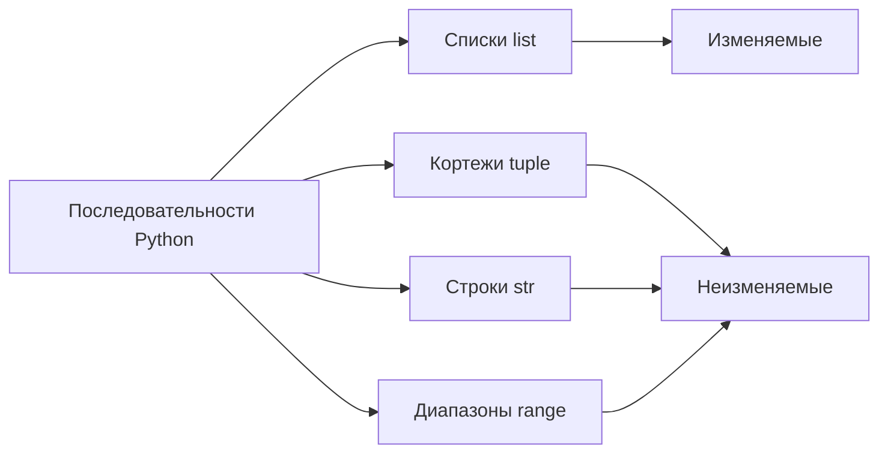
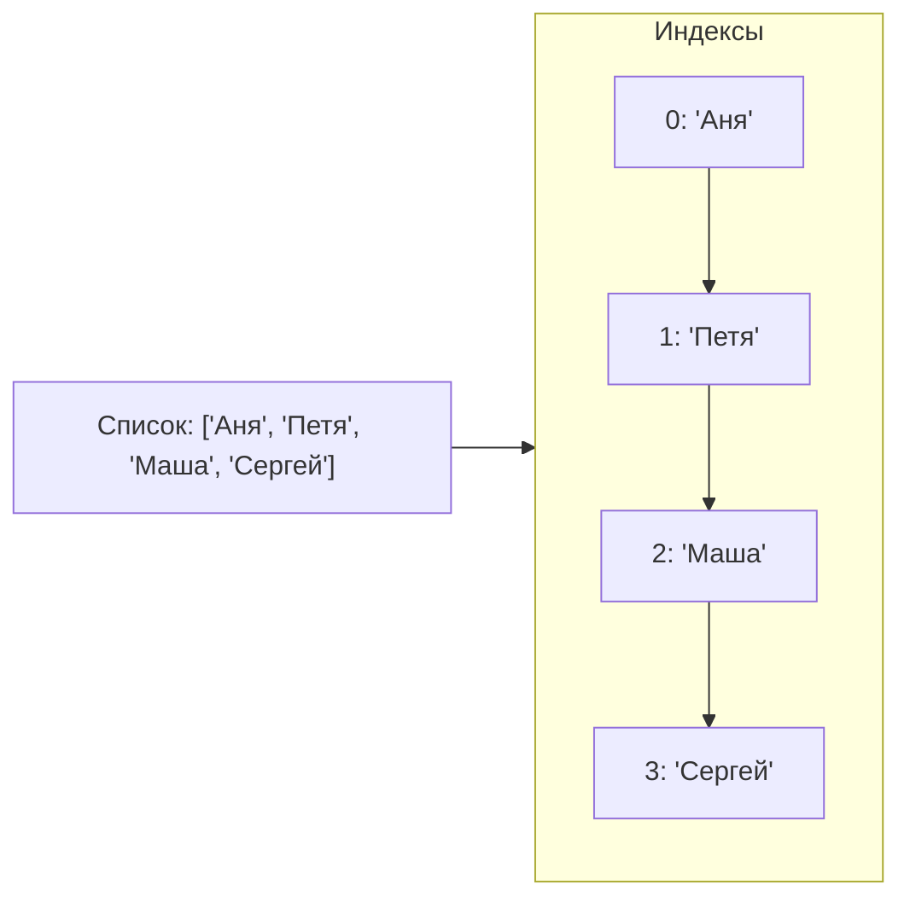

# Списки в Python: Храним всё подряд!

**Оглавление:**
1. [Что такое последовательности в Python?](#последовательности)
2. [Списки (list) - универсальные хранилища](#списки)
3. [Индексы - как найти нужный элемент](#индексы)
4. [Методы списков - что можно делать со списками](#методы)
5. [Практические примеры](#практика)

---

### 🧐 Краткая выжимка

*   **Последовательность** - упорядоченный набор элементов
*   **Список (list)** - изменяемая последовательность любых элементов: `[1, "текст", 3.14]`
*   **Индексы** - номера элементов, начинаются с 0: `список[0]` - первый элемент
*   **Срезы** - получение части списка: `список[начало:конец]`
*   **Методы** - встроенные операции: `append()`, `remove()`, `sort()`, `pop()`
*   **Длина списка** - `len(список)` возвращает количество элементов

---

<a id="последовательности"></a>
### 1. Что такое последовательности в Python?

Представь, что у тебя есть набор разноцветных кубиков, выстроенных в ряд. Каждый кубик стоит на своем месте - первый, второй, третий... В Python такие упорядоченные наборы называются **последовательности**.



**Основные виды последовательностей:**
- **Списки (list)** - можно менять: `[1, 2, 3]`
- **Кортежи (tuple)** - нельзя менять: `(1, 2, 3)`
- **Строки (str)** - текст: `"привет"`
- **Диапазоны (range)** - последовательности чисел: `range(5)`

<a id="списки"></a>
### 2. Списки (list) - универсальные хранилища

**Список** - это как шкаф с множеством полок, где на каждой полке может лежать что угодно: числа, текст, другие списки!

```python
# Создание списков
empty_list = []
numbers = [1, 2, 3, 4, 5]
mixed_objects = [1, "яблоко", 3.14, True, [1, 2, 3]]
friends = ["Аня", "Петя", "Маша", "Сергей"]

print(f"Список чисел: {numbers}")
print(f"Список друзей: {friends}")
```

**Особенности списков:**
- Элементы сохраняют порядок добавления
- Можно добавлять, удалять, изменять элементы
- Могут содержать элементы разных типов
- Поддерживают индексы и срезы

<a id="индексы"></a>
### 3. Индексы - как найти нужный элемент

**Индекс** - это номер элемента в списке. Важно помнить: нумерация начинается с 0!



```python
friends = ["Аня", "Петя", "Маша", "Сергей"]

# Получение элементов по индексу
print(f"Первый друг: {friends[0]}")
print(f"Второй друг: {friends[1]}")
print(f"Последний друг: {friends[3]}")

# Отрицательные индексы (считаем с конца)
print(f"Последний: {friends[-1]}")
print(f"Предпоследний: {friends[-2]}")
```

**Срезы** - получение части списка:
```python
numbers = [0, 1, 2, 3, 4, 5, 6, 7, 8, 9]

print(numbers[2:5])    # [2, 3, 4] - со 2го до 5го (не включая)
print(numbers[:3])     # [0, 1, 2] - с начала до 3го
print(numbers[7:])     # [7, 8, 9] - с 7го до конца
print(numbers[::2])    # [0, 2, 4, 6, 8] - каждый второй элемент
```

<a id="методы"></a>
### 4. Методы списков - что можно делать со списками

Методы - это специальные команды, которые умеют выполнять списки.

**Добавление элементов:**
```python
games = ["Майнкрафт", "Роблокс"]

# append() - добавить в конец
games.append("Фортнайт")
print(games)

# insert() - вставить на определенную позицию
games.insert(1, "Амонг Ас")
print(games)
```

**Удаление элементов:**
```python
products = ["яблоки", "бананы", "молоко", "хлеб", "бананы"]

# remove() - удалить первый найденный элемент
products.remove("бананы")
print(products)

# pop() - удалить по индексу (и вернуть удаленный элемент)
removed_item = products.pop(1)
print(f"Удалили: {removed_item}")
print(products)
```

**Поиск и информация:**
```python
grades = [5, 4, 3, 5, 4, 5, 3]

# index() - найти индекс элемента
first_three_index = grades.index(3)
print(f"Первая тройка на позиции: {first_three_index}")

# count() - посчитать количество элементов
fives_count = grades.count(5)
print(f"Количество пятерок: {fives_count}")

# len() - длина списка
total_grades = len(grades)
print(f"Всего оценок: {total_grades}")
```

**Сортировка:**
```python
digits = [3, 1, 4, 1, 5, 9, 2]
names = ["Петя", "Аня", "Маша", "Борис"]

# sort() - отсортировать сам список
digits.sort()
print(digits)

names.sort()
print(names)

# sorted() - создать отсортированную копию
original = [3, 1, 4, 1, 5]
sorted_list = sorted(original)
print(f"Исходный: {original}")
print(f"Отсортированный: {sorted_list}")
```

<a id="практика"></a>
### 5. Практические примеры

**Игровая инвентарь:**
```python
inventory = ["меч", "щит", "зелье здоровья"]

print("Твой инвентарь:")
for i, item in enumerate(inventory):
    print(f"{i+1}. {item}")

# Добавляем новый предмет
new_item = input("Что нашел? ")
inventory.append(new_item)

print(f"Обновленный инвентарь: {inventory}")
```

**Система оценок:**
```python
grades = []

while True:
    grade = input("Введи оценку (или 'стоп' для выхода): ")
    if grade.lower() == "стоп":
        break
    grades.append(int(grade))

if grades:
    average = sum(grades) / len(grades)
    print(f"Твои оценки: {grades}")
    print(f"Средний балл: {average:.1f}")
    print(f"Лучшая оценка: {max(grades)}")
    print(f"Худшая оценка: {min(grades)}")
```

**Случайный выбор:**
```python
import random

tasks = [
    "сделать уроки",
    "почитать книгу", 
    "помыть посуду",
    "поиграть в футбол",
    "написать программу"
]

print("Случайная задача на сегодня:")
random_task = random.choice(tasks)
print(f"🎯 {random_task}")

# Перемешиваем список
random.shuffle(tasks)
print("Все задачи в случайном порядке:")
for task in tasks:
    print(f"- {task}")
```
