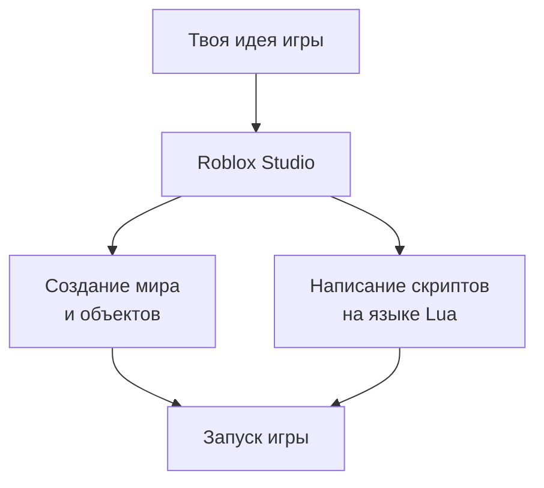

# Начинаем программировать в Roblox: Основы Lua

**Оглавление:**
1. [Что такое Roblox Studio и Lua?](#введение)
2. [Первые шаги: переменные и типы данных](#переменные)
3. [Функции print() и вызовы методов](#функции)
4. [Базовые операции и математика](#операции)
5. [Таблицы - основа Lua](#таблицы)
6. [Практика: создаем первый скрипт](#практика)

---

### 🧐 Краткая выжимка

*   **Roblox Studio** - программа для создания игр в Roblox
*   **Lua** - язык программирования, используемый в Roblox
*   **Переменные** - создаются без ключевых слов: `name = "Игрок"`
*   **Типы данных**: number, string, boolean, table
*   **Таблицы** - универсальные структуры данных: `{1, 2, 3}`
*   **print()** - вывод информации в консоль
*   **Методы объектов** - функции, привязанные к объектам: `part:Destroy()`

---

<a id="введение"></a>
### 1. Что такое Roblox Studio и Lua?

**Roblox Studio** - это мощный редактор, где ты можешь создавать свои собственные игры для Roblox. Представь его как цифровой конструктор, где ты строишь миры и добавляешь в них интерактивность с помощью программирования.

**Lua** - это язык программирования, который используется в Roblox. Он простой в изучении, но мощный enough для создания сложных игр.



**Где писать код в Roblox Studio:**
1. Открой Roblox Studio
2. Создай новый проект
3. В "Explorer" найди "ServerScriptService"
4. Кликни правой кнопкой → "Insert Object" → "Script"

<a id="переменные"></a>
### 2. Первые шаги: переменные и типы данных

В Lua переменные создаются очень просто - просто напиши имя и присвой значение!

```lua
-- Создание переменных
playerName = "Алексей"           -- Строка (string)
playerLevel = 25                 -- Число (number)
isPlayerOnline = true            -- Логический тип (boolean)
playerSpeed = 15.5               -- Дробное число

-- Вывод значений
print(playerName)
print(playerLevel)
print("Игрок онлайн: " .. tostring(isPlayerOnline))
```

**Основные типы данных в Lua:**
- **number** - числа (целые и дробные)
- **string** - текст в кавычках
- **boolean** - true (правда) или false (ложь)
- **table** - таблицы (списки и словари)
- **nil** - пустое значение

<a id="функции"></a>
### 3. Функции print() и вызовы методов

**print()** - твой лучший друг для отладки! Она выводит информацию в консоль.

```lua
-- Простой вывод
print("Привет, мир!")
print(2 + 2)

-- Вывод нескольких значений
print("Игрок:", playerName, "Уровень:", playerLevel)

-- Конкатенация строк (объединение)
message = "Добро пожаловать, " .. playerName .. "!"
print(message)
```

**Работа с объектами Roblox:**
```lua
-- Создание новой детали
local part = Instance.new("Part")
part.Name = "МояДеталь"
part.Position = Vector3.new(0, 10, 0)
part.Parent = workspace

-- Вызов методов объекта
part:Destroy()  -- Уничтожает деталь
```

<a id="операции"></a>
### 4. Базовые операции и математика

Lua поддерживает все основные математические операции:

```lua
-- Математические операции
health = 100
damage = 15
remainingHealth = health - damage

print("Осталось здоровья: " .. remainingHealth)

-- Операции сравнения
isAlive = remainingHealth > 0
print("Игрок жив: " .. tostring(isAlive))

-- Другие операции
score = 10
score = score + 5    -- Увеличиваем счет на 5
multiplier = score * 2
division = score / 3
```

**Основные операторы:**
- `+` `-` `*` `/` - сложение, вычитание, умножение, деление
- `>` `<` `>=` `<=` - сравнения
- `==` `~=` - равно и не равно
- `..` - объединение строк

<a id="таблицы"></a>
### 5. Таблицы - основа Lua

**Таблицы** в Lua - это как швейцарский нож: они могут быть списками, словарями, объектами и многое другое!

```lua
-- Создание таблицы-списка
players = {"Аня", "Петя", "Маша", "Сергей"}
print("Первый игрок: " .. players[1])  -- В Lua индексы начинаются с 1!

-- Таблица-словарь (ключ-значение)
playerStats = {
    Name = "Алексей",
    Level = 25,
    Experience = 1500,
    IsPremium = true
}

print("Имя игрока: " .. playerStats.Name)
print("Уровень: " .. playerStats.Level)

-- Добавление в таблицу
table.insert(players, "Оля")  -- Добавляем в конец
print("Всего игроков: " .. #players)  -- # - длина таблицы
```

<a id="практика"></a>
### 6. Практика: создаем первый скрипт

Давай создадим простой скрипт, который будет выводить информацию о игроке:

```lua
-- Наш первый скрипт в Roblox!

-- Информация о игроке
local playerInfo = {
    Name = "СуперИгрок",
    Level = 1,
    Health = 100,
    Coins = 50,
    IsAlive = true
}

-- Выводим информацию
print("=== ИНФОРМАЦИЯ О ИГРОКЕ ===")
print("Имя: " .. playerInfo.Name)
print("Уровень: " .. playerInfo.Level)
print("Здоровье: " .. playerInfo.Health)
print("Монеты: " .. playerInfo.Coins)
print("Жив: " .. tostring(playerInfo.IsAlive))

-- Симуляция получения урона
print("\n=== ПОЛУЧЕН УРОН! ===")
local damage = 30
playerInfo.Health = playerInfo.Health - damage

print("Получено урона: " .. damage)
print("Осталось здоровья: " .. playerInfo.Health)

-- Проверяем, жив ли игрок
if playerInfo.Health <= 0 then
    playerInfo.IsAlive = false
    print("💀 Игрок погиб!")
else
    print("🎯 Игрок выжил!")
end
```

**Скрипт для изменения детали:**
```lua
-- Этот скрипт можно прикрепить к детали в Roblox Studio

-- Находим деталь, к которой прикреплен скрипт
local part = script.Parent

-- Меняем свойства детали
part.BrickColor = BrickColor.new("Bright red")  -- Красный цвет
part.Material = Enum.Material.Neon             -- Неоновый материал
part.Position = Vector3.new(0, 20, 0)          -- Поднимаем вверх

print("Деталь изменена!")
print("Название: " .. part.Name)
print("Позиция: " .. tostring(part.Position))
```

**Полезные команды для начала:**
```lua
-- Вывод отладочной информации
print("Скрипт запущен!")

-- Работа с игровым сервисом
local Players = game:GetService("Players")

-- Создание простого интерфейса
local gui = Instance.new("ScreenGui")
gui.Parent = game.Players.LocalPlayer:WaitForChild("PlayerGui")

local textLabel = Instance.new("TextLabel")
textLabel.Text = "Привет, мир!"
textLabel.Size = UDim2.new(0, 200, 0, 50)
textLabel.Parent = gui
```

