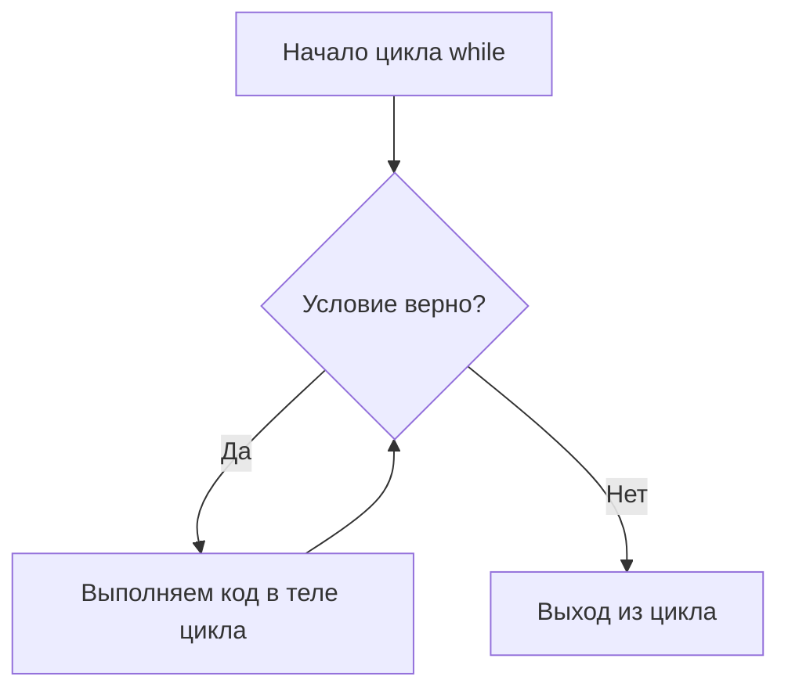
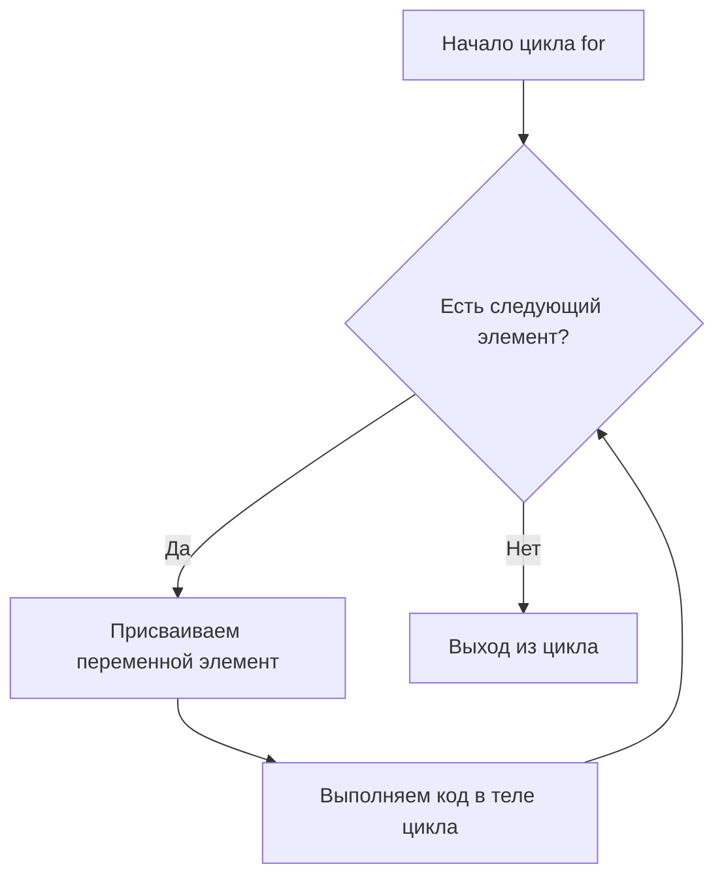

# Циклы: For и While

## 🎯 Что такое цикл?

**Цикл** — это команда, которая заставляет компьютер повторять один и тот же блок кода несколько раз.

Представь, что тебе нужно: перемыть целую гору грязной посуды ИЛИ перебрать все носки в ящике в поисках пары ИЛИ пробежать 10 кругов по стадиону.

Во всех этих случаях ты повторяешь одно и то же действие много раз. Компьютер делает то же самое с помощью циклов!

---

## 🔁 Цикл `while` (цикл "ПОКА")

Цикл `while` повторяет команды **до тех пор, пока** условие является верным (True).

```python
while условие:
    # блок кода, который повторяется
    # (не забудь про отступ в 4 пробела!)
```

**Как это работает:**
Проверяется условие → Если оно `True` — выполняются команды внутри цикла → После этого программа снова возвращается к проверке условия → Если условие стало `False` — цикл заканчивается.



### 💡 Простой пример

```python
# Считаем до пяти
count = 1
while count <= 5:
    print(f"Считаем: {count}")
    count = count + 1  # Увеличиваем count на 1

print("Счёт окончен!")
```

**Вывод:**
```
Считаем: 1
Считаем: 2
Считаем: 3
Считаем: 4
Считаем: 5
Счёт окончен!
```

### ⚠️ Осторожно: Бесконечный цикл!

Если условие всегда `True`, цикл никогда не закончится.

```python
# ВНИМАНИЕ: Этот код будет работать вечно!
while 5 > 1: # 5 всегда больше 1
    print("Застрял в цикле!")
```

**Как избежать?** Всегда убеждайся, что в теле цикла есть команда, которая рано или поздно сделает условие ложным.

---

## ➰ Цикл `for` (цикл "ДЛЯ")

Цикл `for` используется для **перебора элементов** в какой-либо последовательности (например, в строке или диапазоне чисел).

```python
for переменная in последовательность:
    # блок кода для каждого элемента
```

**Как это работает:**
Берётся первый элемент последовательности → Выполняется код цикла → Автоматически переходим к следующему элементу → Когда элементы заканчиваются — цикл завершается.



### 💡 Пример с перебором строки

```python
# Перебираем буквы в слове
word = "ПРИВЕТ"

for letter in word:
    print(f"Сейчас обрабатываю букву: {letter}")

print("Все буквы обработаны!")
```

**Вывод:**
```
Сейчас обрабатываю букву: П
Сейчас обрабатываю букву: Р
Сейчас обрабатываю букву: И
Сейчас обрабатываю букву: В
Сейчас обрабатываю букву: Е
Сейчас обрабатываю букву: Т
Все буквы обработаны!
```

### 🔢 Пример с функцией `range()`

Функция `range()` создаёт последовательность чисел. Идеально для циклов!

`range(5)` → числа от 0 до 4 (5 не входит!)
`range(1, 6)` → числа от 1 до 5
`range(1, 10, 2)` → числа от 1 до 9 с шагом 2: 1, 3, 5, 7, 9

```python
# Выводим таблицу умножения на 3
for i in range(1, 4): # i будет равно 1, 2, 3
    result = 3 * i
    print(f"3 * {i} = {result}")
```

**Вывод:**
```
3 * 1 = 3
3 * 2 = 6
3 * 3 = 9
```

---

## 🤔 `while` или `for`? Что выбрать?

**Цикл `while` (`ПОКА`)**: Используй, когда **не знаешь точно**, сколько раз нужно повторить код. Пример: Игра продолжается, `пока` у игрока есть жизни. Пример: Повторять вопрос, `пока` пользователь не введёт корректный ответ.

**Цикл `for` (`ДЛЯ`)**: Используй, когда **заранее известно** количество повторов или нужно перебрать все элементы. Пример: Перебрать `все` буквы в слове. Пример: Повторить код ровно `10` раз.


---

## 🛠️ Практикуемся: Задачи

### Задача 1: Умный справочник
Напиши программу, которая будет бесконечно спрашивать у пользователя название игры, пока он не введет слово "стоп".

```python
print("Введите ваши любимые игры. Для окончания введите 'стоп'")

user_input = ""
while user_input != "стоп":
    user_input = input("Введите название игры: ")
    if user_input != "стоп":
        print(f"Игра '{user_input}' добавлена!")
```

### Задача 2: Сумматор
Посчитай сумму всех чётных чисел от 2 до 20 с помощью цикла `for`.

```python
total = 0
for number in range(2, 21, 2): # Шаг 2: 2, 4, 6...20
    total = total + number

print(f"Сумма всех чётных чисел от 2 до 20 равна: {total}")
```

### Задача 3: Переборщик букв
Напиши программу, которая перебирает каждую букву в твоём имени и выводит её номер по порядку.

```python
name = "Алексей"
position = 1

for letter in name:
    print(f"Буква №{position}: {letter}")
    position += 1
```

---

## 💎 Главное в двух словах

**Цикл `while`** — это "**пока**". Повторяй, пока условие истинно.
**Цикл `for`** — это "**для каждого**". Перебери все элементы в последовательности.
**`range()`** — твой лучший друг для создания последовательностей чисел в цикле `for`.
**Остерегайся бесконечных циклов** в `while`!

---
